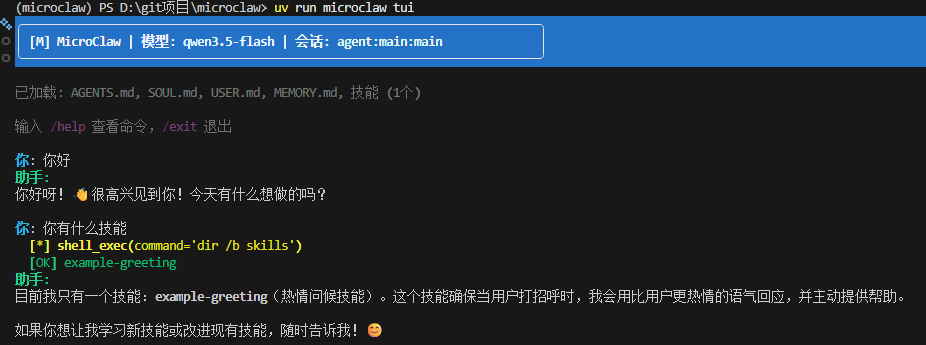

# MicroClaw

<p align="center">
  <a href="README_EN.md">English</a> | <b>中文</b>
</p>

<p align="center">
  
</p>

一个轻量级的 Python Agent 编排框架，借鉴了 [OpenClaw](https://github.com/openclaw/openclaw) 的架构设计。

整个框架约 **3000 行代码**，旨在帮助你理解 Agent 系统的核心概念：

- **思考-行动-观察循环**：Agent 的基本运行模式
- **会话管理**：支持按用户、按群组隔离，可配置每日自动重置
- **工作区记忆**：用 Markdown 文件存储人格、用户信息、长期记忆和每日日志
- **技能系统**：通过 YAML frontmatter 格式定义自定义技能，所有会话共享
- **工具系统**：通过装饰器快速定义和注册工具
- **多模型支持**：OpenAI、Anthropic、Ollama，以及各类兼容 OpenAI API 的服务
- **终端界面**：基于 Rich 库的交互式 TUI
- **飞书集成**：支持私聊和群聊 @机器人

## 五分钟上手

```bash
# 克隆项目
git clone https://github.com/StanleyChanH/MicroClaw.git
cd microclaw

# 安装依赖（需要先安装 uv）
uv sync

# 配置环境变量（复制模板并填入密钥）
cp .env.example .env
# 编辑 .env 文件，设置 OPENAI_API_KEY 和 OPENAI_BASE_URL

# 启动 TUI 界面（推荐）
uv run microclaw tui
```

<p align="center">
  
</p>

```bash
# 或启动简单 CLI
uv run microclaw
```

**.env 配置示例：**

```bash
# OpenAI 兼容 API（适用于 DeepSeek、阿里云通义、Moonshot 等）
OPENAI_API_KEY=your-api-key
OPENAI_BASE_URL=https://api.openai.com/v1

# MicroClaw 配置
MICROCLAW_MODEL=gpt-4o-mini
MICROCLAW_PROVIDER=openai
```

## 系统架构

```
┌──────────────────────────────────────┐
│           接入层 (Channels)          │
│    CLI / Webhook / 飞书 / 可扩展      │
└─────────────────┬────────────────────┘
                  ▼
┌──────────────────────────────────────┐
│            网关 (Gateway)            │
│     消息路由 · 会话管理 · 事件分发    │
└─────────────────┬────────────────────┘
                  ▼
┌──────────────────────────────────────┐
│           Agent 核心循环              │
│    思考 → 调用工具 → 观察结果 → 循环   │
└─────────────────┬────────────────────┘
        ┌─────────┴─────────┐
        ▼                   ▼
┌──────────────┐    ┌──────────────┐
│   会话存储    │    │   工作区      │
│              │    │              │
│ · JSONL 日志  │    │ · SOUL.md    │
│ · 自动重置    │    │ · USER.md    │
│ · 上下文压缩  │    │ · MEMORY.md  │
│              │    │ · skills/    │
└──────────────┘    └──────────────┘
```

## 核心功能

### 会话管理

采用 OpenClaw 的会话键命名规范，灵活支持不同场景：

```
agent:main:main                    # 默认会话
agent:main:dm:user123              # 按用户隔离的私聊
agent:main:whatsapp:group:123456   # 群组会话
cron:daily-report                  # 定时任务
```

每个会话独立维护对话历史，支持：

- **定时重置**：每天凌晨 4 点自动清空（可配置）
- **空闲超时**：长时间不活动自动重置
- **上下文压缩**：接近 token 上限时自动总结历史对话

### 工作区记忆

用纯文本文件管理 Agent 的"长期记忆"，放在 `~/.microclaw/workspace/` 目录下：

| 文件 | 用途 |
|------|------|
| `AGENTS.md` | 工作区说明和 Agent 行为指南 |
| `SOUL.md` | Agent 的人格设定和行为准则 |
| `USER.md` | 用户的个人信息和偏好 |
| `MEMORY.md` | 需要长期记住的重要信息（**仅主会话加载**，群聊不加载以保护隐私） |
| `memory/YYYY-MM-DD.md` | 每日日志，记录当天发生的事情 |
| `skills/` | 技能目录，存放自定义技能 |

**自动加载：** 启动 TUI 时会显示已加载的文件列表。所有内容会自动注入到系统提示中，Agent 无需手动读取。

### 技能系统

MicroClaw 支持从工作区 `skills/` 目录加载自定义技能。技能使用 Claude Code 风格的格式：

**目录结构：**

```
~/.microclaw/workspace/skills/
├── my-skill/
│   └── skill.md
└── another-skill/
    └── skill.md
```

**skill.md 格式（带 YAML frontmatter）：**

```markdown
---
name: my-skill
description: 技能描述
version: 1.0.0
---

# 技能标题

技能内容...
- 始终加载：所有会话共享
- 可以定义行为规则、回复风格等
```

技能会在构建系统提示时自动加载，所有会话共享。

### 多模型支持

```python
from microclaw import Agent, AgentConfig

# OpenAI
agent = Agent(AgentConfig(model="gpt-4o", provider="openai"))

# Anthropic Claude
agent = Agent(AgentConfig(model="claude-sonnet-4-20250514", provider="anthropic"))

# 本地模型
agent = Agent(AgentConfig(model="llama3.2", provider="ollama"))

# 兼容 OpenAI API 的服务（DeepSeek、Kimi、智谱等）
agent = Agent(AgentConfig(
    model="deepseek-chat",
    provider="openai_compatible",
    base_url="https://api.deepseek.com"
))
```

### 自定义工具

用 `@tool` 装饰器即可定义工具：

```python
from microclaw import tool, Gateway

@tool(description="查询城市天气")
def get_weather(city: str) -> str:
    # 实际项目中可以调用天气 API
    return f"{city}：晴，22°C"

gateway = Gateway()
gateway.add_tool(get_weather)
```

## 命令行使用

```bash
microclaw [命令] [选项]

命令：
  (无)        交互式命令行
  tui         启动终端界面
  gateway     启动网关服务

常用选项：
  -m, --model      指定模型（默认 gpt-4o-mini）
  -p, --provider   指定提供商（openai/anthropic/ollama/openai_compatible）
  --base-url       自定义 API 地址
  --one-shot MSG   单次对话后退出
```

### 连接国产大模型

```bash
# DeepSeek
uv run microclaw -p openai_compatible --base-url https://api.deepseek.com -m deepseek-chat

# Kimi (Moonshot)
uv run microclaw -p openai_compatible --base-url https://api.moonshot.cn/v1 -m moonshot-v1-8k

# 智谱 GLM
uv run microclaw -p openai_compatible --base-url https://open.bigmodel.cn/api/paas/v4 -m glm-4

# 本地部署的 vLLM
uv run microclaw -p openai_compatible --base-url http://localhost:8000/v1 -m your-model
```

也可以通过环境变量配置：

```bash
export OPENAI_BASE_URL="https://api.deepseek.com"
export OPENAI_API_KEY="your-api-key"
uv run microclaw -p openai_compatible -m deepseek-chat
```

### Windows 兼容性

MicroClaw 完全支持 Windows！系统会自动处理平台差异：

**Shell 命令自动转换：**

| Unix 命令 | Windows 命令 |
|---------|---------|
| `ls` | `dir` |
| `cat` | `type` |
| `rm` | `del` |
| `pwd` | `cd` |
| `which` | `where` |

你只需使用熟悉的 Unix 命令，系统会自动转换为 Windows 等效命令。

**推荐终端：**
- Windows Terminal（推荐）
- VSCode 终端
- PowerShell 7+

> 注意：传统 CMD/PowerShell 可能显示中文乱码，这是终端编码限制，不影响功能。

### 飞书机器人

支持私聊和群聊 @机器人，可配合阿里云通义千问等国产大模型使用。

**1. 安装依赖：**

```bash
uv sync --extra feishu
```

**2. 配置密钥（复制模板）：**

```bash
cp .env.example .env
# 编辑 .env 文件，填入真实密钥
```

**3. 运行飞书机器人：**

```bash
uv run python examples/feishu_qwen.py
```

**本地测试（使用 ngrok 内网穿透）：**

```bash
# 安装 ngrok: https://ngrok.com/download
# 启动内网穿透
ngrok http 8081
# 会得到公网地址，如 https://xxxx.ngrok-free.app

# 在飞书开放平台配置事件订阅地址:
# https://xxxx.ngrok-free.app/feishu/webhook
```

**飞书开放平台配置：**

1. 创建企业自建应用，获取 App ID 和 App Secret
2. 事件订阅 → 配置地址
3. 订阅事件：`im.message.receive_v1`
4. 权限管理 → 添加 `im:message`, `im:message:send_as_bot`
5. 发布版本 → 发布应用
6. 将机器人添加到群聊或开启私聊

**支持的 LLM 提供商：**

所有 OpenAI 兼容 API 统一使用 `OPENAI_API_KEY` 和 `OPENAI_BASE_URL` 环境变量：

| 提供商 | base_url | 模型 |
|------|----------|------|
| OpenAI | `https://api.openai.com/v1` | `gpt-4o`, `gpt-4o-mini` |
| DeepSeek | `https://api.deepseek.com` | `deepseek-chat` |
| 阿里云通义 | `https://dashscope.aliyuncs.com/compatible-mode/v1` | `qwen3.5-plus`, `qwen-turbo` |
| Moonshot | `https://api.moonshot.cn/v1` | `moonshot-v1-8k` |
| 智谱 GLM | `https://open.bigmodel.cn/api/paas/v4` | `glm-4` |

**代码示例：**

```python
import os
from microclaw import Gateway, GatewayConfig
from microclaw.channels import FeishuChannel, FeishuConfig

# 使用 OpenAI 兼容 API (阿里云通义千问)
gateway = Gateway(GatewayConfig(
    default_model="qwen3.5-plus",
    default_provider="openai_compatible",
    base_url=os.environ.get("OPENAI_BASE_URL"),  # https://dashscope.aliyuncs.com/compatible-mode/v1
    api_key=os.environ["OPENAI_API_KEY"],
))

# 添加飞书通道
feishu = FeishuChannel(FeishuConfig(
    app_id=os.environ["FEISHU_APP_ID"],
    app_secret=os.environ["FEISHU_APP_SECRET"],
), port=8081)

gateway.add_channel(feishu)
gateway.run()
```

## 代码示例

### 基础对话

```python
from microclaw import Gateway, GatewayConfig, IncomingMessage
import asyncio

gateway = Gateway(GatewayConfig())

async def main():
    msg = IncomingMessage(
        channel="api",
        sender="user",
        content="帮我看看当前目录有什么文件"
    )
    response = await gateway.handle_message(msg)
    print(response)

asyncio.run(main())
```

### 会话操作

```python
from microclaw import SessionStore, SessionKey, ResetPolicy

store = SessionStore(
    storage_dir=".microclaw/sessions",
    reset_policy=ResetPolicy(mode="daily", at_hour=4)
)

# 获取会话（不存在则自动创建）
session = store.get("agent:main:main")

# 强制重置
session = store.reset("agent:main:main")

# 列出最近活跃的会话
recent = store.list(active_minutes=1440)  # 24小时内
```

### 记忆读写

```python
from microclaw import WorkspaceFiles, MemoryConfig

workspace = WorkspaceFiles(MemoryConfig(
    workspace_dir="~/.microclaw/workspace"
))

# 读取人格设定
soul = workspace.read_soul()

# 写入每日日志
workspace.append_daily("- 完成了 MicroClaw 的初步学习")

# 构建完整上下文（用于系统提示）
context = workspace.build_context(is_main_session=True)
```

## 安装说明

使用 [uv](https://docs.astral.sh/uv/) 管理项目依赖：

```bash
# 安装 uv
curl -LsSf https://astral.sh/uv/install.sh | sh

# 基础安装
uv sync

# 安装额外功能
uv sync --extra anthropic    # Claude 支持
uv sync --extra ollama       # 本地模型支持
uv sync --extra feishu       # 飞书机器人
uv sync --extra search       # 网络搜索工具
uv sync --extra all          # 全部功能

# 安装开发工具
uv sync --group dev
```

## 项目结构

```
microclaw/
├── __init__.py       # 包入口
├── tools.py          # 工具系统
├── session.py        # 会话管理
├── memory.py         # 工作区记忆
├── agent.py          # Agent 核心
├── gateway.py        # 网关编排
├── channels/         # 通道实现
│   └── feishu.py     # 飞书通道
├── tui.py            # 终端界面
└── cli.py            # 命令行入口
```

## 与 OpenClaw 的关系

MicroClaw 是一个**教学性质**的实现，帮助你理解 Agent 编排的核心模式。如果你需要生产级部署，请使用 [OpenClaw](https://openclaw.ai)。

| 能力 | MicroClaw | OpenClaw |
|------|-----------|----------|
| 代码规模 | ~3,000 行 | ~50,000 行 |
| 会话管理 | 完整 | 完整 |
| 记忆系统 | 基础（文件存储） | 完整（含向量检索） |
| 接入渠道 | CLI、Webhook、飞书 | WhatsApp、Telegram、Slack 等 |
| 生产可用 | 否 | 是 |

## License

MIT
